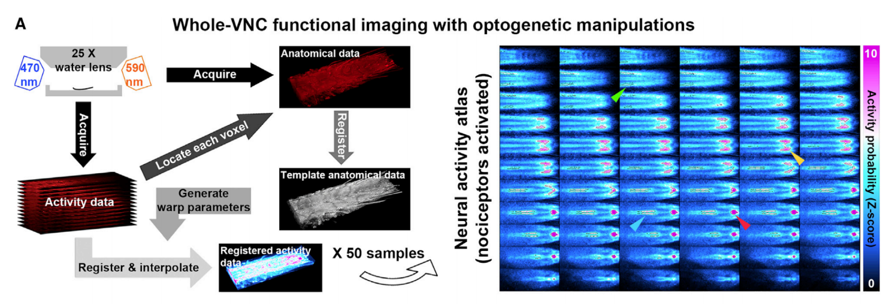
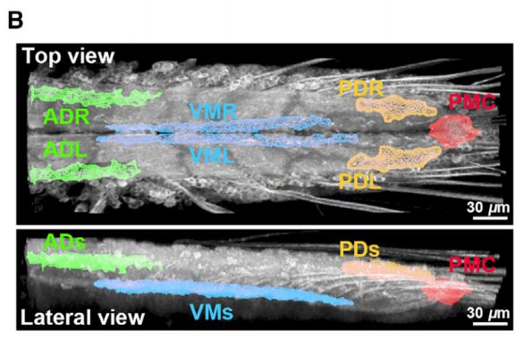

# Whole-VNC Functional Imaging Analysis
This repository is the implementation of a unbiased computational approach for the whole-VNC functional imaging data analysis. For a given calcium neural activity imaging data, it quantifies the probability that a voxel's fluorescence change is due to real calcium signal rather than noise, to measure the fluorescence response of it. This resultant z-score-based response map is comparable across different samples. Based on the response maps from 50 samples, we identified severn decision-associated central nervous system (CNS) regions in Drosophila Larva ventral nerve cord (VNC) which are higly correlated to noxious stimuli, experiments on which help us to understand how graded encodings of noxious stimuli in Larvea CNS converted to binary escape decisions. For more details, please refer to our paper (to be appeared on Current Biology).

## Overview of the framework

A. This figure illustrates the steps for identifying nociceptor-activated CNS regions. Arrows point to different nociceptor-activated CNS regions on representative z sections. The right figure is the average response map over N = 50 larvae. The anterior side of the VNC is to the left. The top left and bottom right panels are the dorsal-most and ventral-most z sections, respectively.

## The identified CNS regions

  

B. The figure illustrates the seven nociceptor-activated CNS regions identified from the right figure in A by iterative thresholding [58]. In all neural activity atlases throughout this study, red, green, yellow, and blue represent PMC, ADs, PDs, and VMs, respectively.

## How to use?
1) Download the testing data and template [here](https://drive.google.com/drive/folders/1w13FSuk6rYh07wa9RLszVn4KzqJUFIng?usp=sharing). (The testing data contains two '.mat' file. One is the template sample, and the other is the testing sample for generating response map.)
2) Put the downloaded data in the folder 'test_data'. (If there is no folder with name 'test_data', create one.)
3) Run the script 'test.m'. (It takes 10~15 minutes on a PC with Core i5-6600 @ 3.30GHz CPU. MATLAB 2017a or later should be all compatible and the Image Processing Toolbox in matlab is needed.) 

## Please refer to our paper if you find the code useful for your research.
Yujia Hu, Congchao Wang, Limin Yang, Geng Pan, Hao Liu, Guoqiang Yu, and Bing Ye, A Neural Basis for Categorizing Sensory Stimuli to Enhance Decision Accuracy. (to be appeared on Current Biology)

# Reference

[58]. Ollion, Jean, et al. "TANGO: a generic tool for high-throughput 3D image analysis for studying nuclear organization." Bioinformatics 29.14 (2013): 1840-1841.

# Updates
